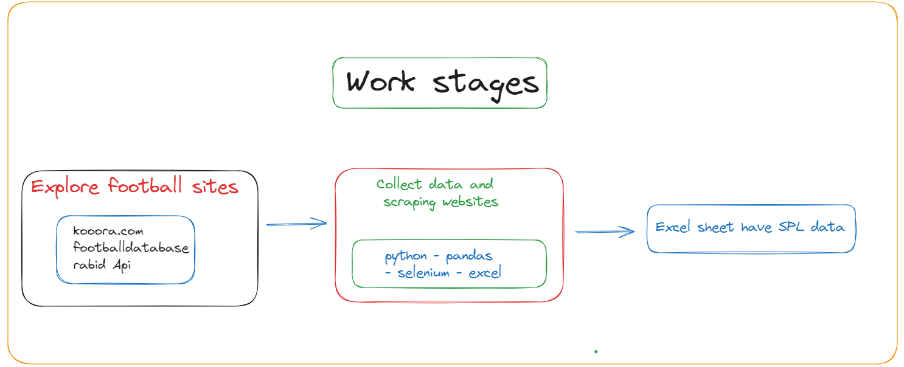

# SPL Web Scraping Project

This project collects data from the Saudi Pro League (SPL) website for the past year and saves it in a CSV file. The data includes match dates, teams, and scores. The project uses Scrapy, a popular web scraping framework.

## Project Structure

```plaintext
.
├── README.md
├── kooora_spider.py
├── requirements.txt
├── spl_matches.csv
```

## Running the Spider

1. Run the Scrapy spider to collect data:

```bash
scrapy runspider kooora_spider.py -o output/spl_matches.csv
```

2. The data will be saved in `output/spl_matches.csv`.

## Project Workflow

Below is a visual representation of the data collection pipeline:

![Workflow][Initiate Spider] --> [Scrape Pages] --> [Parse Data] --> [Save to CSV]

1. **Initiate Spider**: The spider starts with the base URL for the SPL matches.
2. **Scrape Pages**: It iterates through multiple pages to collect match data.
3. **Parse Data**: Extracts match details such as date, teams, and score.
4. **Save to CSV**: Compiles the extracted data into a CSV file.
